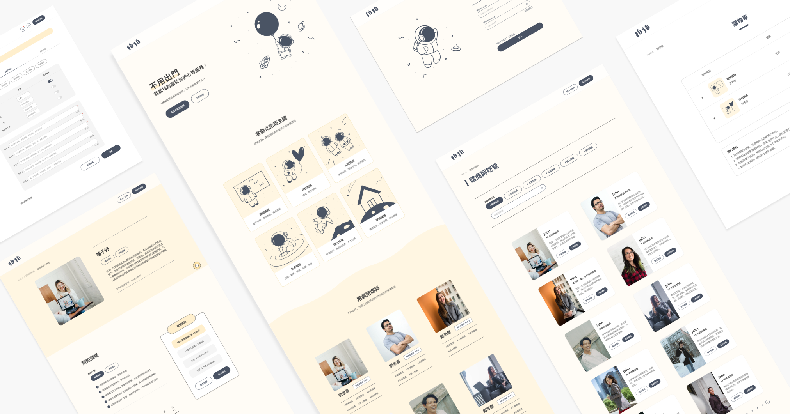

<p align="center">
  <a href="https://pi-rocket-coding.vercel.app/">
    
  </a>
</p>

<h1 align="center" style="font-weight: 700">拍拍｜線上心理諮商平台</h1>

<div align="center" style="margin-bottom:24px">

  <a href="https://drive.google.com/file/d/1e2FiBn9prBCp5041J8-TFq9o6bn2XAPA/view">
  簡報介紹
  </a>
  <span>｜</span>
  <a href="https://pi-rocket-coding.vercel.app/">
  前台網站
  </a>
  <span>｜</span>
  <a href="https://github.com/roceil/Rocket_PI_backend">
  後台Repo
  </a>
  <span>｜</span>
  <a href="https://wistful-cod-85c.notion.site/5cefa38475a64702b599810da2fb3475">
  API List
  </a>
  <span>｜</span>
  <a href="https://pi.rocket-coding.com/swagger/index.html?url=/swagger/v1/swagger.json#/">
  Swagger
  </a>

<br>
<p>
歡迎來到拍拍！拍拍是個線上心理諮商平台<br>
幫助人們克服各種情緒和心理上的困難，改善他們的生活品質。
</p>

</div>

# 拍拍｜線上心理諮商平台

拍拍的進駐諮商師皆為經驗豐富、專業資格齊全的心理學家和臨床心理師，能夠針對每個人的獨特情況提供量身定制的建議和解決方案。您可以隨時隨地在線上與諮商師進行互動，無論您在家中、辦公室或旅途中，都可以方便地使用我們的服務。

我們的目標是成為您信任和依賴的心理諮商平台，幫助您實現自我成長、改善人際關係、克服情緒困擾、減輕壓力和焦慮等問題。歡迎您註冊成為拍拍會員，開始您的心理健康之旅！

---
## 功能介紹

### <-- 用戶端 -->

- 會員註冊/登入
- 會員資料修改
- 會員預約諮商
- 會員查看預約紀錄
- 會員查看諮商師資料
- 會員查看諮商師預約時段
- 會員透過「藍新金流」結帳
- 會員透過「聊天室」與諮商師溝通
- 會員透過「Zoom」連結進行諮商

### <-- 諮商師端 -->

- 諮商師註冊/登入
- 諮商師資料修改
- 諮商師查看預約紀錄
- 諮商師查看會員資料
- 諮商師紀錄諮商過程
- 諮商師上架諮商時段
- 諮商師查看會員預約時段
- 諮商師透過「聊天室」與用戶溝通
- 諮商師透過「Zoom」連結進行諮商

### <--- 管理員端 -->

- 管理員登入
- 管理員查看諮商師審核狀態
- 管理員審核諮商師
- 管理員查看所有訂單狀態
- 管理員查看所有金流狀態
---
## 建議體驗流程
- 個案：
    1. 註冊會員
    2. 選擇心儀的諮商師及課程方案
    3. 完成結帳：
       
       選信用卡一次付清 → 填寫卡號 `4000-2211-1111-1111` → 有效年月填大於今天
      → 驗證碼可隨意填寫 → 付款成功
    4. 前往會員中心選擇預約時段
    5. 等候諮商師接受預約

- 諮商師：
    1. 選擇「我是諮商師」並登入會員
    2. 前往會員中心填寫個人簡介及課程資訊
    3. 上架課程
    4. 收到個案預約通知後，前往會員中心確認預約時段

- 後台管理員：
    1. 登入帳號
    2. 確認新註冊的諮商師資格，並決定是否通過審核，如無法通過審核，則發信要求補件
    3. 確認每筆訂單的課程狀態
    4. 確認每筆訂單的金流狀態，且可搜尋特定用戶的總消費金額
---

## 下載與安裝

Clone 專案

```bash
  git clone https://github.com/roceil/Rocket_Topic_Consultation.git
```

進入專案

```bash
  cd Rocket_Topic_Consultation
```

安裝套件

```bash
  npm install
```

啟動專案

```bash
  npm run dev
```
---

## 資料夾結構

```flow
pi.rocket/
├── public/
│   ├── images/
│   │   ├── 404
│   │   ├── chatRoom
│   │   ├── counselorList
│   │   └── ...
│   ├── loading
│   ├── favicon.ico
│   └── mockServiceWorker.js
├── src/
│   ├── common/
│   │   ├── components/
│   │   │   ├── ChatRoom.tsx
│   │   │   ├── Header.tsx
│   │   │   ├── Footer.tsx
│   │   │   └── ...
│   │   ├── helpers/
│   │   │   ├── customAlert.ts
│   │   │   ├── convertDate.ts
│   │   │   └── convertDescription.ts
│   │   ├── hooks/
│   │   │   ├── useCloseLoading.tsx
│   │   │   └── useOpenLoading.tsx
│   │   ├── msw/
│   │   │   ├── browser.ts
│   │   │   ├── handler.ts
│   │   │   ├── index.ts
│   │   │   └── server.ts
│   │   └── redux/
│   │       ├── feature
│   │       ├── service
│   │       └── store.ts
│   ├── lib/
│   │   ├── hamburger/
│   │   │   └── aryData.tsx
│   │   ├── shoppingCart/
│   │   │   └── shoppingCartData.tsx
│   │   └── ...
│   ├── modules/
│   │   ├── Home/
│   │   │   ├── Banner.tsx
│   │   │   ├── TopicCard.tsx
│   │   │   └── ...
│   │   ├── login/
│   │   │   ├── LogInForm.tsx
│   │   │   └── LogInTab.tsx
│   │   ├── userCenter/
│   │   │   ├── HasCancel.tsx
│   │   │   ├── HasFinish.tsx
│   │   │   └── ...
│   │   ├── counselorCenter/
│   │   │   ├── CounselorCenterLayout.tsx
│   │   │   └── ...
│   │   └── ...
│   ├── pages/
│   │   ├── api/
│   │   │   └── bluepay/
│   │   │       └── return.ts
│   │   ├── _app.tsx
│   │   ├── _document.tsx
│   │   ├── index.tsx
│   │   ├── login.tsx
│   │   ├── 404.tsx
│   │   ├── success.tsx
│   │   └── ...
│   ├── styles/
│   │   ├── antd
│   │   ├── swiper
│   │   ├── waves
│   │   └── global.css
│   └── types/
│       └── interface.ts
├── package.json
├── .eslintrc.json
├── .prettierrc
├── README.md
├── tailwind.confing.js
└── tsconfig.json
```
---

## Git Commit 規則

| 類型       | 格式                              | 範例                               |
| :--------- | :-------------------------------- | :--------------------------------- |
| `新增功能` | `[Feat] create [ModalName]`       | `[Feat] create header`             |
| `修補錯誤` | `[Fix] fix [ModalName] bug`       | `[Fix] fix carousel bug`           |
| `樣式相關` | `[Style] adjust [ModalName] gap`  | `[Style] adjust card gap`          |
| `更新檔案` | `[Update] update [ModalName] pic` | `[Update] update user pic`         |
| `重構代碼` | `[Refactor] refactor [ModalName]` | `[Refactor] refactor API function` |
| `快速更新` | `[Hotfix] fix [ModalName]`        | `[Hotfix] fix API function`        |

---
## Git Branch 命名規則 

- 以類型格式為開頭並大寫，如：Feat
- 以區塊為命名提示並大寫，如：OrderStep
- 範例：`Feat/OrderStep`

---
## Git Flow 
- 以 GitHub Flow 為基礎，建立符合團隊迭代頻率的客製化 Git Flow

---

## 技術規格

<h2 align="center">👩‍💻 設計工具</h2>
 <p>
  
  
  
  
  
  

  ### 工具說明：

* [ 設計稿製作 ]：Figma
    * 用於製作線稿、精稿及 prototype。
    * 方便團隊之間協作，理解產品操作流程

* [ 繪圖工具 ]：Procreate
   - 用於繪製插圖及 loading 動畫
   - 內建筆刷庫非常豐富，且能針對每種筆刷自由調整參數
   - 支援匯出各式檔案
</p>

<h2 align="center">💻 前端技術</h2>
 <p>
  
  
  
  
  
  
  
  
  
  
  
  
  
  
  
  
  

### 技術說明：

* [ 環境 ]：Next 13
    * 使用Next.js來進行SSR，讓網頁能夠快速的載入，並且透過head元件，使諮商師頁面能夠在SEO上有更好的表現。

* [ 框架 ]：React
    * 使用React來進行前端開發，透過React的生態系，能夠快速的開發出一個網頁，並且透過React的生命週期，能夠更好的管理網頁的狀態。

* [ 語言 ]：TypeScript
    * 語言使用TypeScript來進行開發，透過型別管理，減少協作間產生衝突的機會。

*  [ CSS ]：Tailwind
    * 使用Tailwind來進行CSS的開發，透過Tailwind的原子化架構，可以增加協作時的樣式更改效率。

* [ 部署平台 ]：Vercel／Zeabur
    * 使用Vercel及Zeabur來進行部署，透過Vercel的自動化部署，能夠快速的部署網頁；而Zeabur的集成式服務，則是能夠增加未來網站快速建構資料庫的可能性。
</p>

<h2 align="center">⌨️ 後端技術</h2>
 <p>
  
  
  
  
  
  
  
  
  
  
  
  

  ### 技術說明：

* [ 環境 ]：Microsoft Visual Studio
    * 使用的是.net Freamwork 平台，網頁技術版本則是asp.net。

* [ 框架 ]：ASP.NET Web API 2
    * 一個由Microsoft開發的框架，用於快速構建Web API的接口。裡面包含Get、Post、Put、Delete、Patch等。

* [ 資料庫 ]：Microsoft SQL Server
    * 微軟的關聯式資料庫，用來查詢垂直擴展的關聯表格，可以高效的查詢表跟表之間的關聯資料。

*  [ 技術 ]：SignalR
    * SignalR是一個由Microsoft開發的開源庫，根據情況使用WebSocket、Server-Sent Events或Long Polling等技術來實現雙向通信。能迅速地渲染使用者的畫面。

* [ 雲端平台 ]：Azure
    * Microsoft提供一個雲端平台，讓使用者可以使用多種的服務，其中有計算、存儲、資料庫、部署和管理自己的應用程序。

</p>
